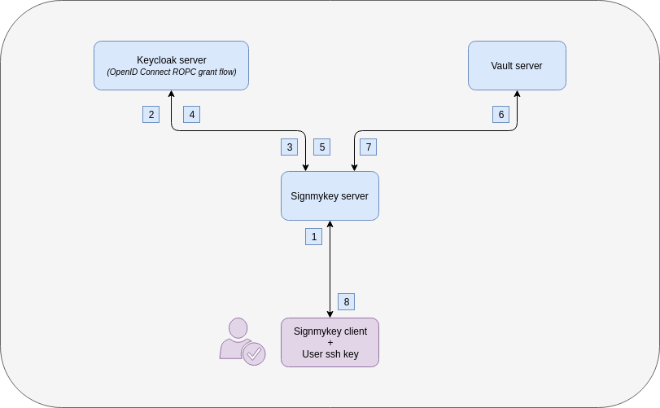
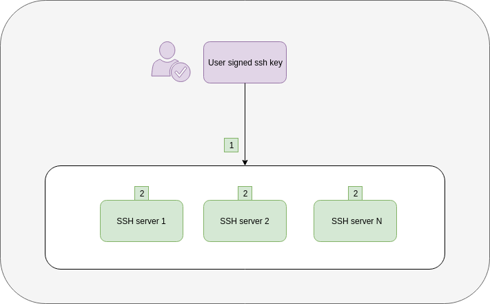

## signmykey

### What is it ?

Signmykey is a server and a client used to sign SSH keys using Hashicorp [Vault](https://www.vaultproject.io/docs/secrets/ssh/signed-ssh-certificates.html).

It helps you to delegate the signing part and the principals in your organization with the same workflow.

Principals are the roles allowed within an SSH account, they are based on groups provided in Signmykey.

It can use **LDAP** or **OpenID Connect ROPC** as authentication/principals backends.

### What do you need ?

- **One** authentication system, **choose** between:
  -  an LDAP server, see [Howto](howtos/ldapserver/)
  -  an OpenID Connect ROPC compliant server, such as Keycloak, see [Howto](howtos/oidcropc/)
- a Vault instance, see [Howto](howtos/vaultpki/)
- a signmykey host

## How does it work ?

### Signmykey workflow with LDAP

1. The user uses `signmykey` then enters its credentials, Signmykey client sends to Signmykey server user credentials and user SSH public key
2. Signmykey server sends user credentials to LDAP server (Authenticator)
3. LDAP server returns validation to Signmykey server if successful
4. Signmykey server sends username to LDAP server (Principals)
5. LDAP server responds with user groups as Principals
6. Signmykey server asks Vault to sign the public key with groups as principals
7. Vault gives back the signed key to Signmykey server
8. Signmykey server gives back the signed key to the user

Signmykey allows you to let your LDAP users to sign theirs SSH keys with principals using the **memberOf** attribute.

### Signmykey workflow with OpenID Connect ROPC

OpenID Connect ROPC stands for OpenID Connect ["Resource Owner Password Credentials"](https://tools.ietf.org/html/rfc6749#page-37) grant flow.

1. The user uses `signmykey` then enters its credentials, Signmykey client sends to Signmykey server user credentials and user SSH public key
2. Signmykey server sends user credentials + OIDC client ID and secret to Keycloak using Token Endpoint (Authenticator)
3. Keycloak server responds with an authentication token if successful
4. Signmykey server sends authentication token to Keycloak using Userinfo Endpoint (Principals)
5. Keycloak server responds with user groups as Principals
6. Signmykey server asks Vault to sign the public key with groups as principals
7. Vault gives back the signed key to Signmykey server
8. Signmykey server gives back the signed key to the user

### SSH workflow

This SSH workflow is independent of the chosen Signmykey workflow.

1. The user enters `ssh <signmykey_user>@<server>` from his terminal
2. The SSH server verifies that the certificate 
    - is signed with the CA installed locally
    - is valid
    - has the correct principals in /etc/ssh/authorized_principals/ files