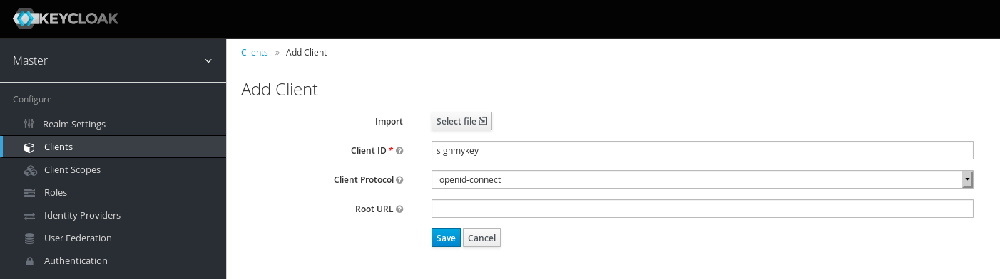
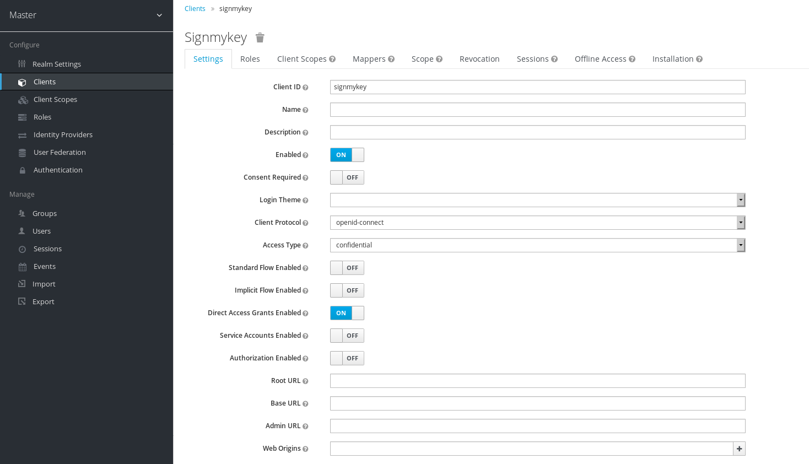
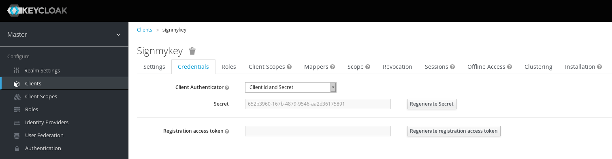
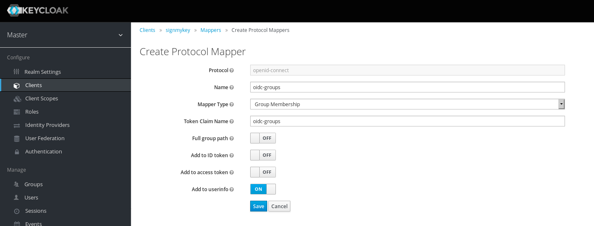

This HOWTO describe how to configure an OpenID Connect ROPC client using [Keycloak](https://www.keycloak.org/).

Your Keycloak server must be already setup.

## Create a new client in your Realm

Using Admin web interface:

Important options:

- Client ID: signmykey (will be used in signmykey config file)
- Client Protocol: openid-connect

## Client options

Important options:

- Client ID: signmykey
- Access Type: confidential
- Direct Access Grants Enabled: ON (This enables ROPC grant flow)

## Grab Client Secret

Once you saved configuration with "Access Type: confidential", you now have access to credentials.

**Secret** will be used in signmykey config file.

## Create a protocol Mapper for groups

This option will provide groups to userinfo as "oidc-groups" entry.

Important options:

- Name: oidc-groups
- Mapper Type: Group Membership
- Token Claim Name: oidc-groups (will be used in signmykey config file)
- Full group path: OFF
- Add to ID token: OFF
- Add to access token: OFF
- Add to userinfo: ON